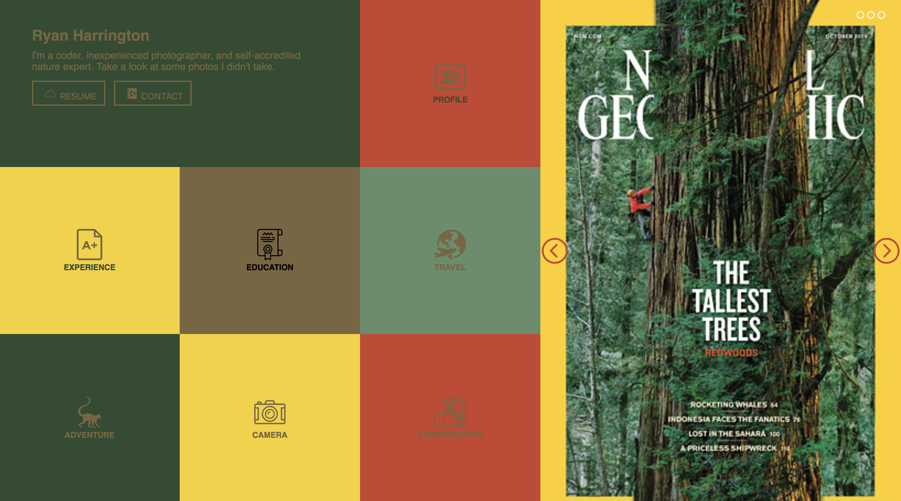

# rh-comp-challenge-1
Recreated spec with my own theme.

Most interesting parts of this project:

Learning how to affect children elements via mouseevents on parent element. (Hiding icon and article name on :hover or :active of containing element).

Learning how to slightly get around the downward cascading nature of CSS. Altering the containing element by mouse-event on child element by turning mouse-events off on parent and giving parent a :hover, then passing the mouse event to a child element. (left and right arrow changing background image of parent section).

